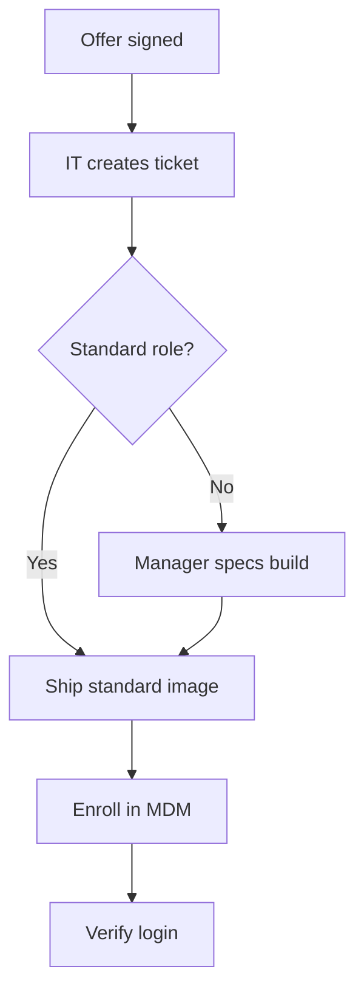

# Process Documentation

## When to use
Use this to capture how a repeatable process actually runs so it can be trained, audited, or handed off, and whenever tribal knowledge needs to become a durable, followable SOP.

**Not for:** improving a broken process (use ops-process-optimization — document the current reality first, then optimize), or one-off tasks that will never repeat.

## Method
1. **Frame the process.** State its name, purpose, trigger (what starts it), and definition of done.
2. **Identify actors.** List every role that touches the process; you will map them in the RACI.
3. **Map the steps.** Walk it end to end. Per step capture action, actor, inputs, outputs, and decision points. *Decision:* document what happens *today*, not the idealized version — mark known deviations.
4. **Draw the flowchart.** Render the sequence as a Mermaid `flowchart` with decision diamonds for branches.
5. **Build the RACI.** Per step assign Responsible, Accountable, Consulted, Informed — exactly one Accountable per step. *Decision:* two candidates for Accountable means the step is really two steps; split it.
6. **Write the SOP.** Turn steps into numbered, imperative instructions with tools, timing, and quality checks.
7. **Add controls.** Note exceptions, escalation paths, and where errors are caught.

## Example
**Process:** new-hire laptop provisioning. **Trigger:** signed offer in HRIS. **Done:** employee logs in day 1.

RACI step "Ship image": R=IT tech, A=IT lead, C=hiring manager, I=HR.

## Pitfalls
- **Documenting the ideal, not the actual.** An SOP that doesn't match reality trains people to ignore it.
- **Multiple Accountables per step.** Diffused accountability means no one owns the outcome; enforce one A.
- **Steps with no decision branches.** Real processes fork; a purely linear diagram hides the exceptions that cause errors.
- **No review cadence.** Undated SOPs rot silently; stamp owner, version, and next review.

## Output format
```
Overview:   name | purpose | trigger | done-when | frequency
Flowchart:  Mermaid flowchart TD
RACI:       rows = steps, columns = roles (one A per row)
SOP:        numbered steps | owner | tools | duration | quality check
Exceptions: escalation paths, error catches
Revision:   owner | version | review cadence
```
